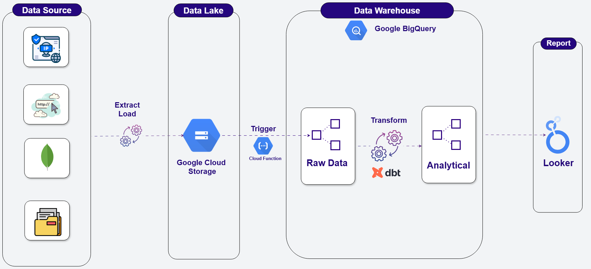

**Glamira Batch Data Pipeline**

### 1. Introduction:
**Objective:** Build an automated batch data pipeline to process daily data from the database of the Glamira website, a global jewelry retail platform. The data will be extracted and loaded into a data lake before being transferred to a data warehouse for transformation and modeling into dimension and fact tables. These tables will be ready for data analysts to generate reports and extract insights.

**Data Source:** The Glamira website database, which is stored in MongoDB.

**Technologies Used:** Airflow, DBT, Google VM, GCS, Google Cloud Functions, BigQuery, Looker.

### 2. Requirement Analysis:
- **Input Data:** Raw data containing user behavior information when interacting with the Glamira website. The user's activity is described through the `collection` field in the database.
- **Output Data:** Cleaned and normalized data for successful orders, indicated by the "checkout_success" value in the `collection` field.
- **Pipeline Execution Frequency:** Daily.

### 3. Data Description and Data Pipeline Workflow:
#### **Data Source:** MongoDB

**Schema:**
```json
{
    "_id": "STRING",               // ObjectId in MongoDB
    "time_stamp": "INTEGER",       // Timestamp (in seconds) representing the time of the action
    "ip": "STRING",                // User's IP address
    "user_agent": "STRING",        // Browser, OS, and device information
    "resolution": "STRING",        // Device screen resolution
    "user_id_db": "STRING",        // User ID in MongoDB
    "device_id": "STRING",         // User's device ID
    "api_version": "STRING",       // API version
    "store_id": "STRING",          // Store ID where the customer is interacting
    "local_time": "STRING",        // User's local time
    "show_recommendation": "STRING", // Indicates if a product recommendation was shown before viewing
    "current_url": "STRING",       // Current webpage URL
    "referrer_url": "STRING",      // Previous webpage URL before landing on the current page
    "email_address": "STRING",     // User's email address
    "recommendation": "STRING",    // Recommended product information
    "utm_source": "BOOLEAN",       // User traffic source
    "utm_medium": "BOOLEAN",       // Website access medium (organic, CPC, email, etc.)
    "collection": "STRING",        // User action type on the website
    "key_search": "STRING",        // Search keywords before landing on the website
    "product_id": "STRING",        // Product ID the user interacts with
    "option": [                      // Selected product options
        {
            "alloy": "STRING",      // Alloy type (metal and color combination)
            "diamond": "STRING",    // Diamond type
            "shapediamond": "STRING", // Diamond shape
            "stone": "STRING",      // Gemstone type
            "pearlcolor": "STRING", // Pearl color
            "option_label": "STRING", // Option label
            "option_id": "STRING", // Option ID
            "value_label": "STRING", // Specific option details
            "value_id": "STRING",  // Specific option ID
            "quality": "STRING",   // Product quantity
            "finish": "STRING",    // Product finish quality
            "price": "STRING",     // Product price
            "category_id": "STRING", // Category ID
            "kollektion": "STRING", // Collection name
            "kollektion_id": "STRING" // Collection ID
        }
    ],
    "cat_id": "STRING",             // Product category ID
    "collect_id": "STRING",         // Product collection ID
    "order_id": "STRING",           // Order ID
    "price": "STRING",              // Product price
    "currency": "STRING",           // Currency
    "is_paypal": "STRING",          // Indicates if the user paid via PayPal
    "cart_products": [                // List of products in the shopping cart
        {
            "product_id": "INTEGER",  // Product ID in the cart
            "price": "STRING",        // Product price
            "currency": "STRING",     // Currency
            "amount": "INTEGER",      // Product quantity
            "option": [                 // Product options in the cart
                {
                    "option_label": "STRING",
                    "option_id": "INTEGER",
                    "value_label": "STRING",
                    "value_id": "INTEGER"
                }
            ]
        }
    ],
    "viewing_product_id": "STRING",             // Product ID viewed by the user
    "recommendation_product_id": "STRING",      // ID of recommended product
    "recommendation_product_position": "INTEGER", // Position of recommended product on the page
    "recommendation_clicked_position": "INTEGER"  // Position of recommended product clicked by the user
}
```

### **Processing Workflow:**
1. A Python program extracts IP addresses from the database and uses the IP2Location library to convert them into geographic locations, storing the results in the `Locations` collection in MongoDB.
2. A Scrapy-based web crawler scrapes all URLs containing product names and saves the data into a CSV file.
3. A Python program extracts data from the sources above and loads it into the data lake (Google Cloud Storage - GCS).
4. Once the raw data is stored in the data lake, Google Cloud Functions automatically triggers the transfer of data from GCS to Google BigQuery.
5. The data is transformed and modeled using DBT.
6. The processed data from the data warehouse is used to build dashboards in Looker.
